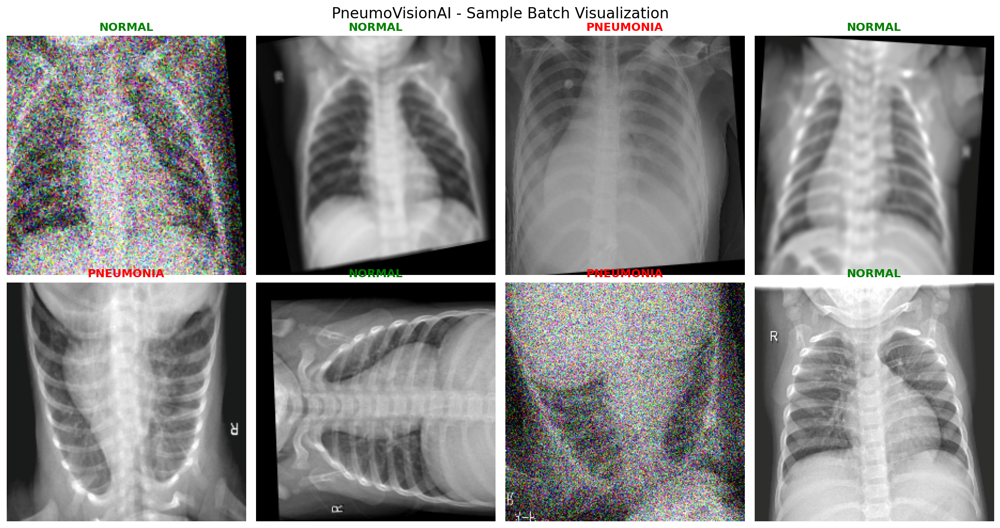
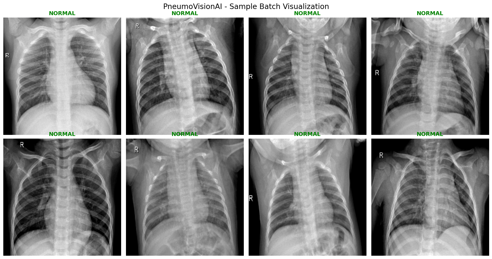
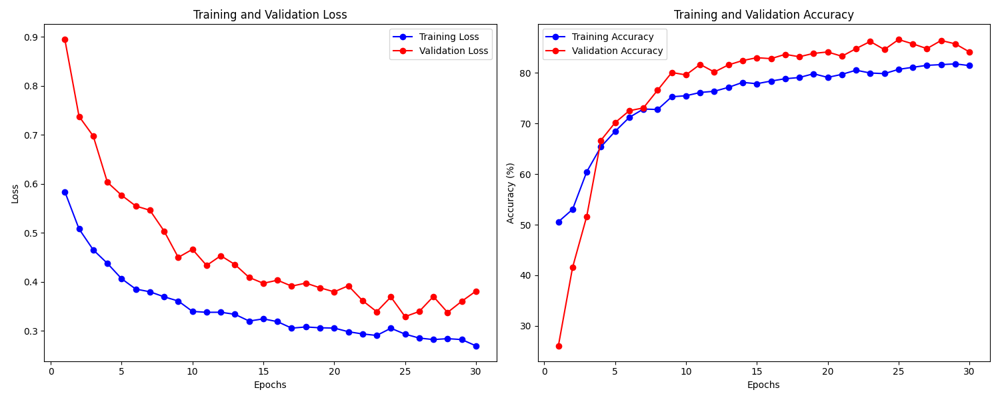
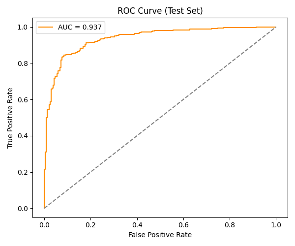

# 🫁 PneumoVisionAI

**AI-Powered Pneumonia Detection from Chest X-rays**

PneumoVisionAI is a deep learning project using PyTorch to classify chest X-ray images for pneumonia detection. This project demonstrates computer vision techniques, medical image analysis, and responsible AI practices in healthcare applications.

---

## 🎯 Project Overview

PneumoVisionAI uses convolutional neural networks (CNNs) to automatically detect pneumonia in chest X-ray images. The system is trained on the [Kaggle Chest X-ray Images (Pneumonia)](https://www.kaggle.com/datasets/paultimothymooney/chest-xray-pneumonia) dataset and achieves high accuracy in distinguishing between normal and pneumonia-affected X-rays.

---

## 🖼️ Visualizations

### Training Batch Sample - Augmented X-rays with noise artifacts and rotations


### Validation Batch Sample - Unaugmented X-rays labeled NORMAL


---

## 📊 Model Performance

### Training and Validation Over 30 Epochs - Loss & Accuracy


### ROC & AUC Results


### Classification Report (Test Set)

```
              precision    recall  f1-score   support

      NORMAL     0.7816    0.8718    0.8242       234
   PNEUMONIA     0.9174    0.8538    0.8845       390

    accuracy                         0.8606       624
   macro avg     0.8495    0.8628    0.8544       624
weighted avg     0.8665    0.8606    0.8619       624

Accuracy: 0.8606

Confusion Matrix:
[[204  30]
 [ 57 333]]
```

### Key Clinical Metrics

```
Sensitivity (Pneumonia Recall): 0.8538
Specificity (Normal Recall):    0.8718
ROC-AUC:                        0.9374
```

---

## 🏆 Key Accomplishments

- **Pipeline** - Set up a robust data pipeline for image data.
- **Convolutional Neural Network (CNN) Training** - Built and trained both a baseline and a powerful pre-trained CNN using PyTorch.
- **Workflow** - Implemented a full training and evaluation workflow.
- **Performance Analysis** - Achieved a strong final performance and analyzed the results.

---

## 💡 Key Concepts & Implementations

- **Deep Learning Architectures (PyTorch, CNNs, Transfer Learning)**
    - **PyTorch** - For model definition, training, and evaluation.
    - **Custom CNNs & Pretrained Models** - Implementing and adapting architectures like ResNet-50 using transfer learning, with custom layers and classifier heads.
    - **Device Management** - Leveraging GPU, Apple’s MPS, or CPU for computation.

- **Medical Image Data Engineering & Augmentation**
    - **Advanced Data Handling** - Creation of custom PyTorch Datasets for class-balanced sampling, caching, and on-the-fly augmentation.
    - **Albumentations** - Powerful image augmentation/transformation library (with handling for warnings and correct transform setup for medical data).

- **Model Evaluation & Clinical Metrics**
    - **Performance Metrics** - Calculation and correct clinical interpretation of sensitivity, specificity, ROC-AUC, f1-score, and confusion matrices.
    - **Visualization** - Publication-grade metrics visualization (ROC curves, confusion matrices with seaborn/matplotlib).

- **Experiment Management & Logging**
    - **TensorBoard** - Logging scalar metrics and visualizing training progress.
    - **Matplotlib/Seaborn** - For static visualization of learning curves and performance.
    - **Command-line Interface (argparse)** - For configurable training and evaluation runs, supporting reproducibility.

- **Data Science & Scientific Python Ecosystem**
    - **NumPy / pandas** - For array and metric calculations.
    - **scikit-learn** - For `classification_report`, confusion matrix, ROC-AUC, and advanced metrics.
    - **tqdm** - For live progress bars during long-running operations.

- **Project Structure & Workflow**
    - **Modular Codebase** - Using separate files/modules for dataset, models, training, and evaluation.
    - **Output Management** - Saving models, logs, plots, and text metrics for later analysis or publication.

---

## ⚠️ Medical Data Privacy

**DO NOT COMMIT MEDICAL DATA TO GIT**

This project works with medical imaging data. Please:
- Never commit patient data or medical images to version control
- Keep all data in the `./data/` directory (which is gitignored)
- Follow HIPAA guidelines if working with real patient data
- Use only publicly available research datasets

---

## 🚀 Quick Start

### 1. Clone Repository
```bash
git clone https://github.com/yourusername/PneumoVisionAI.git
cd PneumoVisionAI
```

### 2. Set Up Virtual Environment
```bash
python -m venv venv
source venv/bin/activate  # On Windows: venv\Scripts\activate
```

### 3. Install Dependencies
```bash
pip install -r requirements.txt
```

### 4. Download Dataset
```bash
# Requires Kaggle API credentials (~1.15GB)
kaggle datasets download -d paultimothymooney/chest-xray-pneumonia
unzip chest-xray-pneumonia.zip -d ./data/
rm chest-xray-pneumonia.zip  # Clean up zip file
```

### 5. Verify Data Structure
Your `./data/` directory should look like:

```
./data/
├── train/
│   ├── NORMAL/
│   └── PNEUMONIA/
├── val/
│   ├── NORMAL/
│   └── PNEUMONIA/
└── test/
    ├── NORMAL/
    └── PNEUMONIA/
```

---

## 📁 Project Structure

```
PneumoVisionAI/
├── src/
│   ├── data_exploration.py   # Dataset analysis and visualization
│   ├── dataset.py            # PyTorch dataset and data loaders
│   ├── models.py             # CNN architectures
│   ├── train.py              # Training pipeline
│   └── evaluate.py           # Model evaluation and metrics
├── notebooks/
│   └── exploration.ipynb     # Jupyter notebooks for analysis
├── models/                   # Saved model checkpoints (gitignored)
├── logs/                     # Training logs (gitignored)
├── images/                   # Generated visualizations
├── figures/                  # Generated visualizations (gitignored)
├── data/                     # Dataset directory (gitignored)
├── requirements.txt          # Python dependencies
├── .gitignore                # Git ignore file
└── README.md                 # This file
```

---

## 🔧 Technologies

- **PyTorch** - The core deep learning framework used to build and train the neural network models.
- **Albumentations** - A fast and powerful library for advanced image augmentation.
- **Scikit-learn** - Used for calculating and reporting key performance metrics like the classification report, confusion matrix, and AUC score.
- **NumPy** - The fundamental package for numerical operations and data manipulation.
- **Matplotlib & Seaborn** - Used to generate visualizations of the training history, confusion matrix, and ROC curve.
- **TensorBoard** - For real-time logging and visualization of the model's training progress.
- **Argparse** - Used to create the command-line interface for the training and evaluation scripts.
- **tqdm** - For displaying clean, informative progress bars during training and evaluation.

---

## 🏃‍♂️ Training

### Default training
```bash
python src/train.py
```

### Custom parameters
```bash
python src/train.py --epochs 50 --batch-size 32 --learning-rate 0.001
```

---

## 📈 Monitoring

Visualize training progress with TensorBoard:

```bash
tensorboard --logdir logs/
```

---

## 🧭 Project Roadmap

- **Data** - Add more data sources (e.g., from NIH or RSNA) to increase diversity and reduce overfitting
- **Models** - Try DenseNet121 or Vision Transformers (via timm library) for potentially higher accuracy on X-rays. EfficientNet is efficient for deployment.
- **Fine-tuning** - Train with freeze_layers=True first, then unfreeze and train with lower LR (e.g., 1e-4) for better results.
- **Interpretability** - Add Grad-CAM or similar for visualizing what the model focuses on in X-rays (e.g., lung consolidations).
- **Deployment** - Once trained, export to ONNX for inference.

---

## 🤝 Contributing

Contributions are welcome! Please feel free to submit a pull request.

---

## 📄 License

This project is licensed under the **MIT License** – see the [LICENSE](LICENSE) file for details.

---

## 🙏 Acknowledgments

- **Dataset**: [Chest X-Ray Images (Pneumonia)](https://www.kaggle.com/datasets/paultimothymooney/chest-xray-pneumonia) on Kaggle  
- **Original Source**:  
  Kermany et al. “Identifying Medical Diagnoses and Treatable Diseases by Image-Based Deep Learning.” _Cell_, 2018.

---

> _Disclaimer: This is an educational project. Any model developed here should not be used for actual medical diagnosis without proper validation and regulatory approval._
